# 🚗 Car Rental Management System

A modern **full-stack Car Rental Management System** built using the **MERN Stack**. The application provides a complete platform where users can explore available cars, view car details, register and log in, make rental bookings, complete a dummy payment flow, and track their booking status.

The project also includes a dedicated **Admin Panel** for managing vehicles and monitoring customer bookings.

---

## 📌 Project Overview

The Car Rental Management System is designed to simplify the process of renting and managing vehicles through a web-based application.

### 👤 Users can:

* Create an account and log in
* Browse available cars
* View car details
* Contact the rental service
* Book rental cars
* Complete a dummy payment flow
* View booking information
* Track booking status

### 👨‍💼 Administrators can:

* Access the admin dashboard
* Add new cars
* Manage available cars
* View customer bookings
* Monitor booking statuses
* Manage rental information

---

# ✨ Features

## 👤 User Features

* 🔐 User Registration & Login
* 🚘 Browse Available Cars
* 📋 View Car Details
* 📅 Car Booking
* 💳 Dummy Payment Flow
* 📞 Contact Details
* 📦 View Booking Information
* 🔄 Track Booking Status
* 📱 Responsive User Interface

## 👨‍💼 Admin Features

* 📊 Admin Dashboard
* ➕ Add New Cars
* 🚘 Manage Cars
* 📋 Manage Customer Bookings
* 🔄 Monitor Booking Status
* 📊 View Booking Information

## 🔒 Authentication & Security

* JWT-based authentication
* Protected routes
* Password hashing
* Secure user authentication
* Role-based access for admin functionality

---

# 📸 Screenshots

## 🏠 Home Page

The home page provides an introduction to the car rental platform and allows users to explore available vehicles and services.

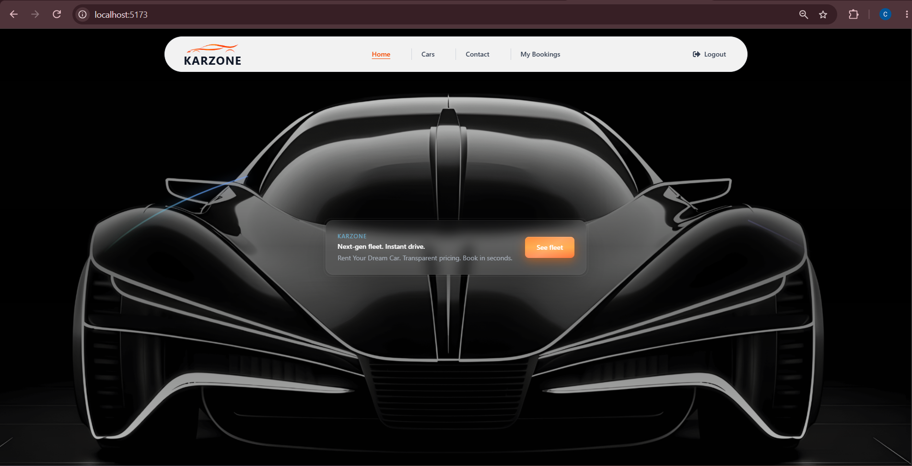

---

## 🚘 Cars Page

The Cars page displays the available vehicles and allows users to explore the cars offered by the rental platform.

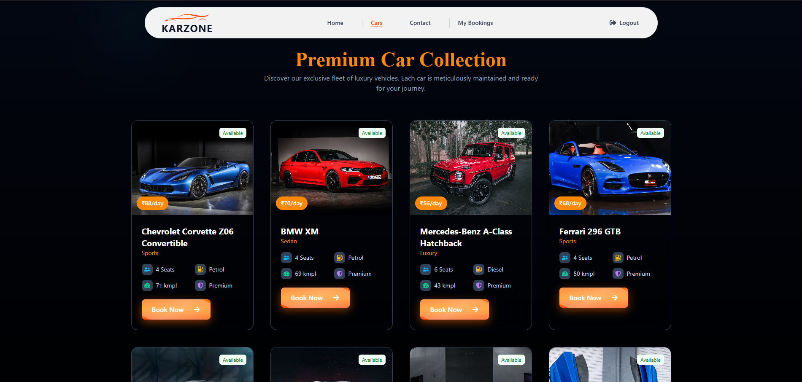

---

## 🔐 Login Page

The Login page allows existing users to securely access their accounts using their registered credentials.

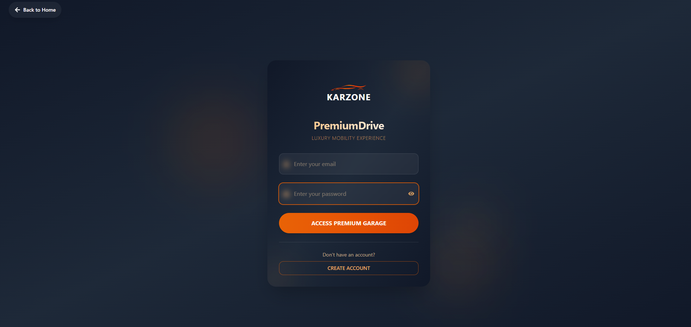

---

## 📝 Register Page

The Register page allows new users to create an account and access the car rental services.

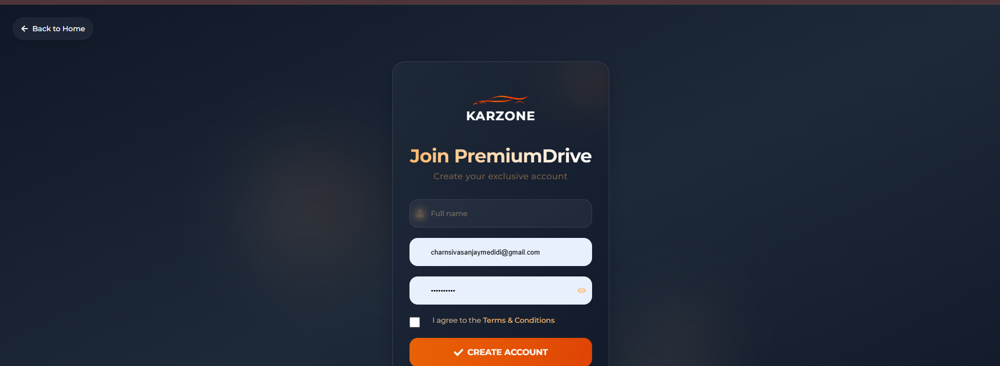

---

## 📞 Contact Details

The Contact section provides users with relevant contact information for getting in touch with the rental service.

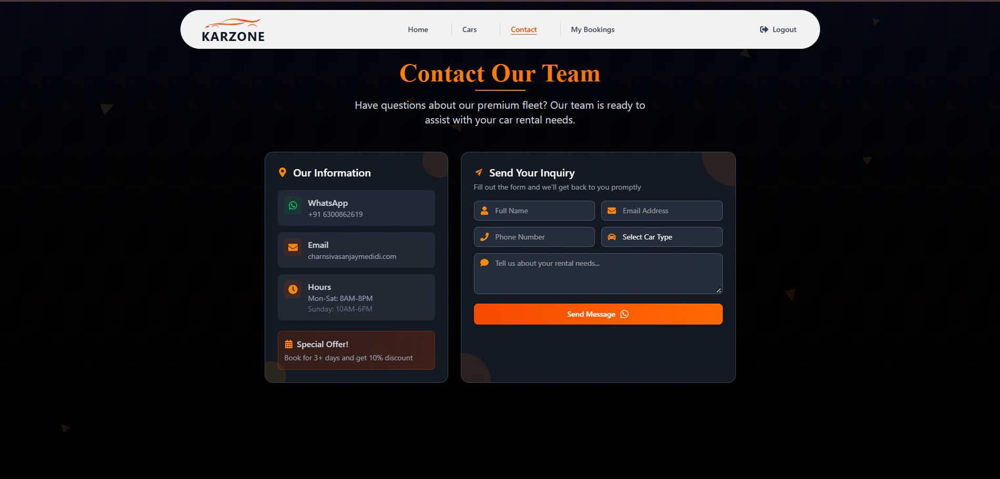

---

# 📅 Booking Management

## 📊 Bookings Dashboard

The Bookings Dashboard allows users to view their rental booking information in one place.

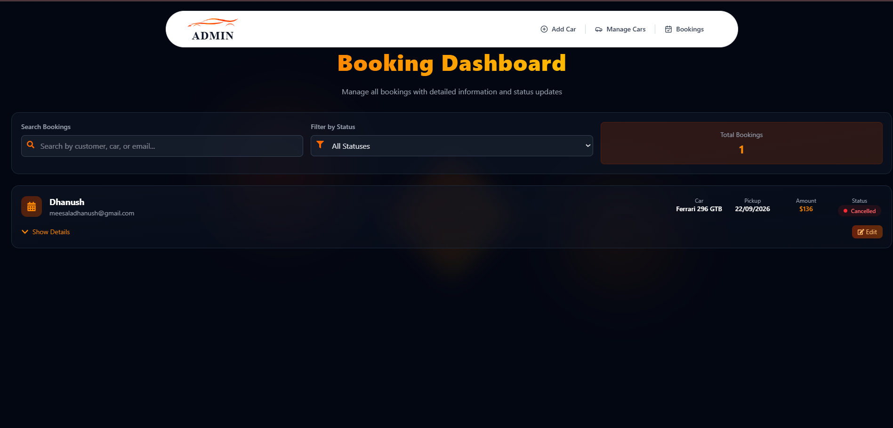

---

## ⏳ Upcoming Bookings

Users can view their upcoming rental bookings and check the details of scheduled rentals.

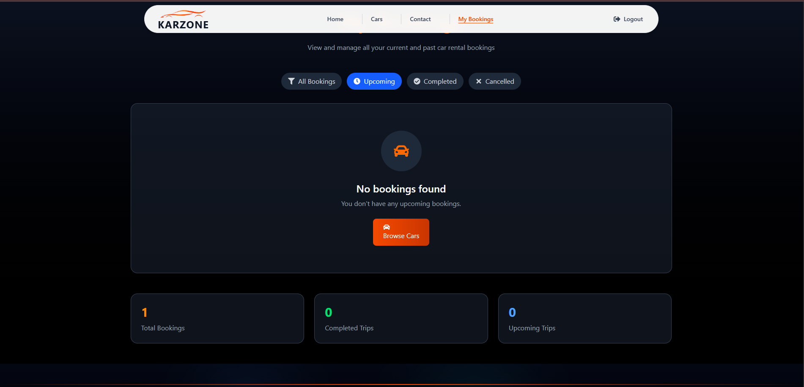

---

## ❌ Cancelled Bookings

Users can view bookings that have been cancelled and check their booking status.

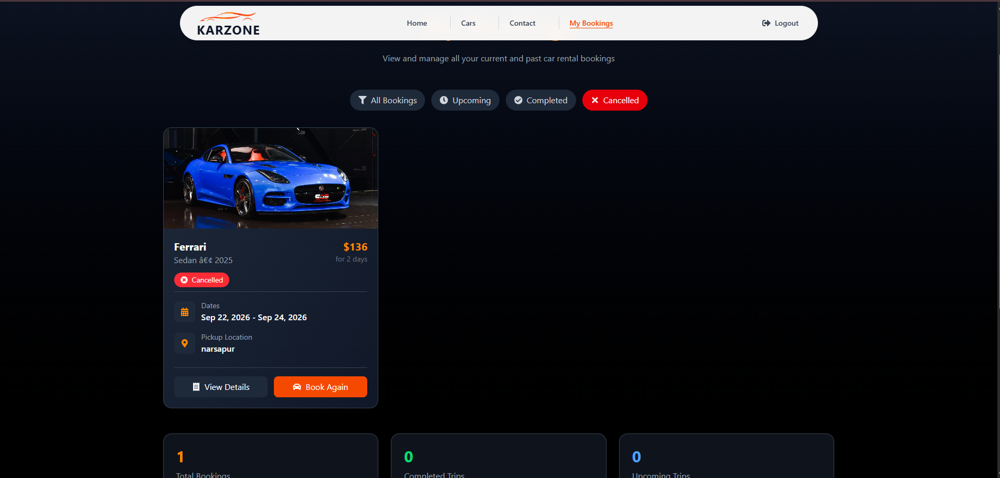

---

# 💳 Payment

## Dummy Payment Flow

The application currently includes a **dummy payment flow** to demonstrate the payment stage of the car rental booking process.

This is intended for demonstration and development purposes and does not process real payments.

---

# 👨‍💼 Admin Panel

## 📊 Admin Dashboard

The Admin Dashboard provides administrators with an interface to manage vehicles and monitor customer bookings.


---

## ➕ Add Car

The Add Car section allows administrators to add new vehicles to the rental platform by providing the required vehicle information.

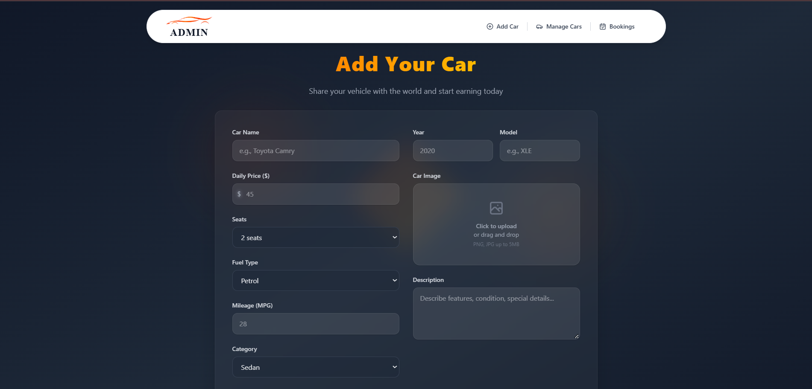

---

## 📋 Manage Bookings

The Manage Bookings section allows administrators to monitor and manage customer rental bookings.

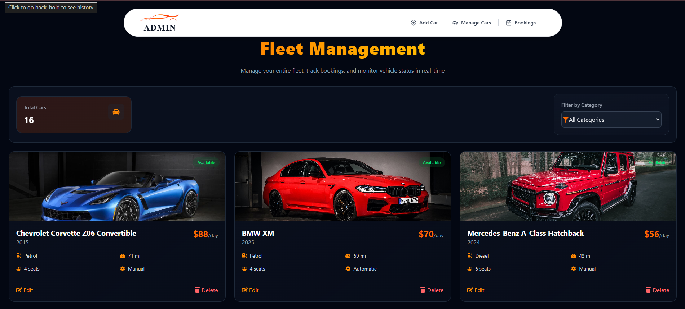

---

## 📊 All Bookings

Administrators can view all customer bookings and monitor the overall booking activity.

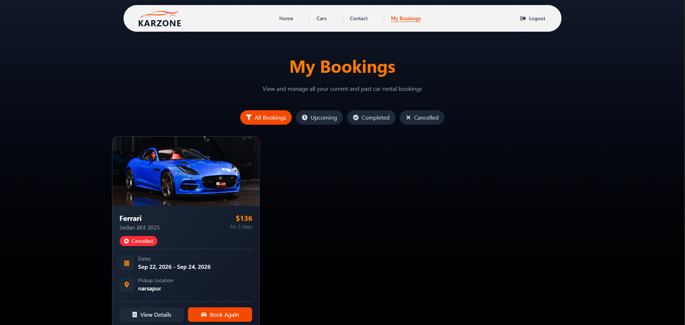

---

## ✅ Completed Bookings

Administrators can view completed rental bookings and track successfully completed bookings.

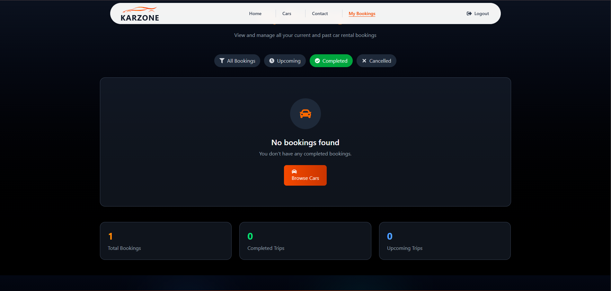

---

# 🛠️ Technologies Used

## Frontend

* React.js
* JavaScript
* HTML5
* CSS3
* Vite

## Backend

* Node.js
* Express.js
* REST APIs

## Database

* MongoDB
* Mongoose

## Authentication

* JSON Web Token (JWT)
* Password Hashing

## Development Tools

* Visual Studio Code
* Git
* GitHub
* npm

---

# 🏗️ Project Architecture

```text
                    ┌─────────────────────┐
                    │       USER          │
                    │     React App       │
                    └──────────┬──────────┘
                               │
                               │ HTTP / REST API
                               ▼
                    ┌─────────────────────┐
                    │      BACKEND        │
                    │ Node.js + Express   │
                    └──────────┬──────────┘
                               │
                               │ Mongoose
                               ▼
                    ┌─────────────────────┐
                    │      MONGODB        │
                    │      Database       │
                    └─────────────────────┘


                    ┌─────────────────────┐
                    │       ADMIN         │
                    │     React App       │
                    └──────────┬──────────┘
                               │
                               │ HTTP / REST API
                               ▼
                    ┌─────────────────────┐
                    │      BACKEND        │
                    └─────────────────────┘
```

---

# 📂 Project Structure

```text
Car-Rental/
│
├── admin/
│   ├── src/
│   ├── public/
│   └── package.json
│
├── backend/
│   ├── config/
│   ├── controllers/
│   ├── middlewares/
│   ├── models/
│   ├── routes/
│   ├── uploads/
│   └── server.js
│
├── frontend/
│   ├── src/
│   ├── public/
│   └── package.json
│
├── screenshots/
│   ├── AddCar.png
│   ├── BookingStatusCancelled.png
│   ├── BookingStatusUpcoming.png
│   ├── BookingsDashboard.png
│   ├── Cars.png
│   ├── ContactDetails.png
│   ├── Home.png
│   ├── Login.png
│   ├── ManageBookings.png
│   ├── Register.png
│   ├── StatusAllBookings.png
│   └── StatusCompleted.png
│
├── .gitignore
├── package-lock.json
└── README.md
```

---

# ⚙️ Installation & Setup

## 1. Clone the Repository

```bash
git clone https://github.com/sanjaymedidi/Car-Rental.git
```

## 2. Navigate to the Project

```bash
cd Car-Rental
```

---

## 3. Install Backend Dependencies

```bash
cd backend
npm install
```

---

## 4. Install Frontend Dependencies

Open a new terminal:

```bash
cd frontend
npm install
```

---

## 5. Install Admin Dependencies

Open another terminal:

```bash
cd admin
npm install
```

---

# 🔑 Environment Variables

Create a `.env` file inside the `backend` directory.

Add the required environment variables used by your backend configuration.

Example:

```env
MONGODB_URI=your_mongodb_connection_string
JWT_SECRET=your_jwt_secret
```

> ⚠️ Never upload your actual `.env` file or database credentials to GitHub.

---

# ▶️ Running the Application

## Start Backend

```bash
cd backend
npm start
```

## Start Frontend

```bash
cd frontend
npm run dev
```

## Start Admin Panel

```bash
cd admin
npm run dev
```

The terminal will display the local URLs for the frontend and admin applications.

---

# 🔄 Application Workflow

```text
                         USER
                          │
                          ▼
                  Register / Login
                          │
                          ▼
                     Browse Cars
                          │
                          ▼
                   Select a Car
                          │
                          ▼
                   View Car Details
                          │
                          ▼
                     Book Car
                          │
                          ▼
                  Dummy Payment
                          │
                          ▼
                  Booking Confirmation
                          │
                          ▼
                  View My Bookings
                          │
                          ▼
                   Track Status


                        ADMIN
                          │
                          ▼
                    Admin Login
                          │
                          ▼
                   Admin Dashboard
                    /          \
                   /            \
                  ▼              ▼
             Manage Cars    Manage Bookings
                  │              │
                  ▼              ▼
               Add Car      Monitor Status
```

---

# 📈 Future Enhancements

The project can be further enhanced with:

* 💳 **Real Online Payment Integration** — Replace the current dummy payment flow with a secure payment gateway.
* 🔎 **Advanced Search & Filtering** — Add filters based on car type, price, brand, availability, and other criteria.
* 📅 **Car Availability Calendar** — Provide a calendar-based view of vehicle availability.
* 📧 **Email Notifications** — Send booking confirmations, updates, and other important notifications through email.
* ⭐ **Customer Reviews & Ratings** — Allow users to review and rate rented vehicles.
* 📍 **Location-Based Car Search** — Enable users to find rental cars based on their preferred location.
* 📊 **Advanced Admin Analytics** — Add detailed statistics and reports for bookings, vehicles, and users.
* 🔔 **Booking Notifications** — Provide real-time or in-app notifications for booking status changes.
* ❌ **Booking Cancellation & Refund Management** — Add cancellation workflows and refund processing for eligible bookings.

---

# 🎯 Project Highlights

* Full-stack MERN architecture
* Separate user frontend and admin application
* REST API-based communication
* MongoDB database integration
* JWT authentication
* Protected routes
* Car management system
* Booking management system
* Dummy payment flow
* Booking status tracking
* Responsive user interface
* Admin management system

---

# 👨‍💻 Developer

## Sanjay Medidi

**MERN Stack Developer**

🔗 **GitHub Repository:**
https://github.com/sanjaymedidi/Car-Rental

---

# ⭐ Support

If you find this project useful or interesting, consider giving the repository a ⭐ on GitHub.

---

## 📄 License

This project is created for learning, development, and portfolio purposes.
